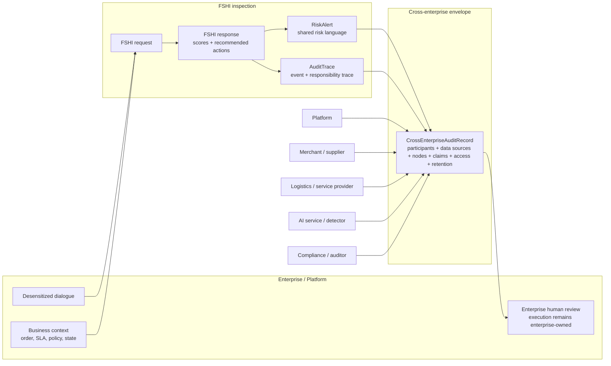

# Cross-Enterprise Audit Record Mapping

Status: draft  
Last updated: 2026-07-03

This document explains how the `CrossEnterpriseAuditRecord` profile connects FSHI inspection, `RiskAlert`, `AuditTrace`, external node classification, and enterprise compliance workflows.

It is a mapping document, not a new standard and not a legal determination mechanism.

Machine-readable schema:

- [`cross-enterprise-audit-record.schema.json`](../../schemas/cross-enterprise-audit-record.schema.json)

Related RFC:

- [RFC 0006: Cross-Enterprise Audit Record Profile](../../rfcs/0006-cross-enterprise-audit-record.md)

Example:

- [cross-enterprise-audit-record.example.json](../../examples/governance/cross-enterprise-audit-record.example.json)

---

## 1. Why this profile exists

FSHI can detect risks in a dialogue and produce protocol objects:

```text
FSHI request
  -> FSHI response
  -> RiskAlert
  -> AuditTrace
```

This is enough for a single enterprise to inspect its own AI customer-service workflow.

However, many real AI workflows are not single-enterprise workflows.

For example, an e-commerce customer-service incident may involve:

- platform customer-service AI;
- merchant product policy;
- logistics state;
- payment or refund workflow;
- external AI service provider;
- enterprise human reviewer;
- compliance or audit department.

In that situation, `RiskAlert` says what risk was detected, and `AuditTrace` records the action chain. But the parties still need a shared envelope that says:

- who participated;
- what data source each party provided;
- which processing node did what;
- which risk and trace objects are linked;
- who accepts, denies, shares, or disputes responsibility;
- who may access which parts of the record;
- how long the record should be retained.

That envelope is `CrossEnterpriseAuditRecord`.

---

## 2. Position in the protocol chain

| Layer | Object | Scope |
| --- | --- | --- |
| Input | FSHI request | Enterprise submits desensitized dialogue and necessary business context |
| Output | FSHI response | FSHI returns scores, risk items, and recommended enterprise actions |
| Risk | RiskAlert | A specific risk is described in a shared risk language |
| Responsibility trace | AuditTrace | The action, detection, review, and recommendation chain is recorded |
| Cross-enterprise envelope | CrossEnterpriseAuditRecord | Multiple parties, data sources, claims, disputes, access, and retention are recorded |

The profile does not replace `RiskAlert` or `AuditTrace`.

It references them and adds cross-enterprise context.

### Visual flow



The diagram shows the intended boundary:

- FSHI inspects and recommends;
- `RiskAlert` records the risk;
- `AuditTrace` records the event and responsibility path;
- `CrossEnterpriseAuditRecord` packages multi-party audit context;
- the enterprise still owns execution and final business action unless a separate authorized integration says otherwise.

---

## 3. Mapping from FSHI

| FSHI field or object | CrossEnterpriseAuditRecord field | Notes |
| --- | --- | --- |
| `inspection_id` | `related_fshi_inspection_id` | Links the record to the FSHI inspection result |
| `tenant_id` | `participants[].participant_id` | The enterprise or platform that submitted the task |
| `subject_identity` | `participants[]` and `processing_nodes[]` | Acting AI, organization, and responsibility owner |
| `dialogue` | `data_sources[]` | Usually referenced as desensitized evidence, not embedded as raw dialogue |
| `business_context` | `data_sources[]` | Order state, SLA, refund state, logistics state, or policy state |
| `risk_items[]` | `risk_alerts[]` | Each risk item may become one `RiskAlert` reference |
| `recommended_enterprise_actions[]` | `audit_traces[]` and `responsibility_claims[]` | FSHI recommends; enterprise decides execution |
| `execution_policy` | `access_policy` and `responsibility_claims[]` | Defines who may execute, review, or reject recommended actions |
| `privacy` | `data_sources[].desensitization_status`, `access_policy`, `retention_policy` | Records minimization, access, retention, and sharing boundary |

---

## 4. Mapping to RiskAlert

`RiskAlert` should remain the canonical risk object.

`CrossEnterpriseAuditRecord.risk_alerts[]` should normally include minimized references:

```json
{
  "risk_id": "risk_fshi_api_mock_0001",
  "risk_dimension": "unauthorized_promise",
  "severity": "medium",
  "summary": "The AI assistant made a delivery-time promise without verified ETA.",
  "source_ref": "examples/fshi/api-contract/risk-alert.sample.json"
}
```

Recommended rule:

- if the record is shared across enterprises, do not embed unnecessary evidence;
- if a reviewer needs more evidence, use lawful internal references or redacted exports;
- if risk interpretation is disputed, record the dispute instead of overwriting the original alert.

---

## 5. Mapping to AuditTrace

`AuditTrace` should remain the canonical responsibility and event trace.

`CrossEnterpriseAuditRecord.audit_traces[]` should normally include references:

```json
{
  "trace_id": "trace_fshi_api_mock_0001",
  "subject_id": "external_customer_service_agent_mock",
  "status": "review_requested",
  "summary": "FSHI recorded risk detection and recommended enterprise-side review.",
  "source_ref": "examples/fshi/api-contract/audit-trace.sample.json"
}
```

Recommended rule:

- keep event-level details in `AuditTrace`;
- use `CrossEnterpriseAuditRecord` to connect traces across participants;
- if one participant disputes the trace, add a dispute object rather than silently editing the trace.

---

## 6. Mapping to external node classification

RFC 0005 defines several node types:

- External Tool Node;
- External Compatible Node;
- Candidate Node;
- Full Spectrum Certified Node.

In `CrossEnterpriseAuditRecord`, these appear mainly in:

- `participants[]`;
- `processing_nodes[]`;
- `responsibility_claims[]`.

Example mapping:

| RFC 0005 node class | CrossEnterpriseAuditRecord representation |
| --- | --- |
| External Tool Node | `processing_nodes[].node_type = "tool"` |
| External Compatible Node | `processing_nodes[].node_type = "external_compatible_node"` |
| Candidate Node | `processing_nodes[].node_type = "ai_agent"` with metadata indicating candidate status |
| Full Spectrum Certified Node | `processing_nodes[].node_type = "certified_node"` |
| FSHI detector | `processing_nodes[].node_type = "fshi_detector"` |

Important boundary:

Compatibility is not certification. A cross-enterprise record may include non-certified nodes, but it should not let them claim certified status.

---

## 7. Mapping to enterprise compliance systems

Most enterprises already have internal systems:

- ticket systems;
- audit logs;
- data-loss-prevention logs;
- customer-service quality systems;
- legal review systems;
- risk-control systems;
- data-governance platforms;
- internal approval workflows.

`CrossEnterpriseAuditRecord` should not replace them.

It should provide a shared protocol-facing envelope:

| Enterprise artifact | CrossEnterpriseAuditRecord field |
| --- | --- |
| Ticket or case ID | `case_id` |
| Internal department or company | `participants[]` |
| Data owner | `data_sources[].provider_id` |
| Processing system | `processing_nodes[]` |
| Risk ticket | `risk_alerts[]` |
| Audit log | `audit_traces[]` |
| Responsibility statement | `responsibility_claims[]` |
| Internal dispute | `disputes[]` |
| Access-control policy | `access_policy` |
| Retention or deletion policy | `retention_policy` |

This lets each enterprise preserve its own internal systems while still exchanging a minimized common audit record.

---

## 8. Relationship to AIP, A2A, MCP, and other interconnection layers

Interconnection protocols answer:

- how an agent is identified;
- how it describes capability;
- how it is discovered;
- how it communicates;
- how it calls tools.

`CrossEnterpriseAuditRecord` answers a different question:

> After agents and enterprises interact, how do we record who participated, what risk appeared, who reviews it, and how responsibility claims are handled?

Suggested relationship:

| Interconnection or identity layer | CrossEnterpriseAuditRecord mapping |
| --- | --- |
| Agent identity code | `participants[].participant_id`, `processing_nodes[].node_id` |
| Capability description | `processing_nodes[].role`, metadata, or linked capability declaration |
| Tool invocation | `processing_nodes[]` and `audit_traces[]` |
| Message/task exchange | `data_sources[]`, `audit_traces[]`, evidence references |
| Data governance | `data_sources[]`, `access_policy`, `retention_policy` |

This profile should anchor to national or enterprise identity systems when required. It should not invent a parallel identity system for regulated contexts.

---

## 9. Responsibility claim mapping

Responsibility claims are not legal conclusions.

They are structured declarations that make responsibility visible.

| Claim type | Meaning |
| --- | --- |
| `accepts` | The claimant accepts responsibility for the declared scope |
| `denies` | The claimant denies responsibility for the declared scope |
| `shares` | The claimant accepts partial or shared responsibility |
| `disputes` | The claimant disputes another claim, risk, trace, or interpretation |
| `unknown` | Responsibility is unresolved or not yet assigned |

Recommended rule:

- do not collapse shared responsibility into one forced owner too early;
- record disagreement explicitly;
- let internal compliance, contract, law, or review process decide enforceable consequences.

---

## 10. Minimal implementation path

For a minimal implementation, a developer should:

1. generate or receive an FSHI inspection response;
2. produce at least one `RiskAlert`;
3. produce at least one `AuditTrace`;
4. create a `CrossEnterpriseAuditRecord`;
5. reference the risk and trace IDs inside the cross-enterprise record;
6. declare participants, data sources, processing nodes, access policy, and retention policy;
7. validate the chain with:

```powershell
powershell -NoProfile -ExecutionPolicy Bypass -File .\scripts\validate-fshi-contract.ps1
```

Current validated chain:

```text
examples/fshi/api-contract/request.sample.json
  -> examples/fshi/api-contract/response.sample.json
  -> examples/fshi/api-contract/risk-alert.sample.json
  -> examples/fshi/api-contract/audit-trace.sample.json
  -> examples/governance/cross-enterprise-audit-record.example.json
```

---

## 11. Boundary statement

This mapping does not:

- create a legal standard;
- decide final liability;
- require sharing raw data;
- replace contracts, regulators, courts, or enterprise compliance systems;
- certify a participant as Full Spectrum native;
- prove that a system is safe.

It exists to make cross-enterprise AI audit records more visible, comparable, and reviewable.

